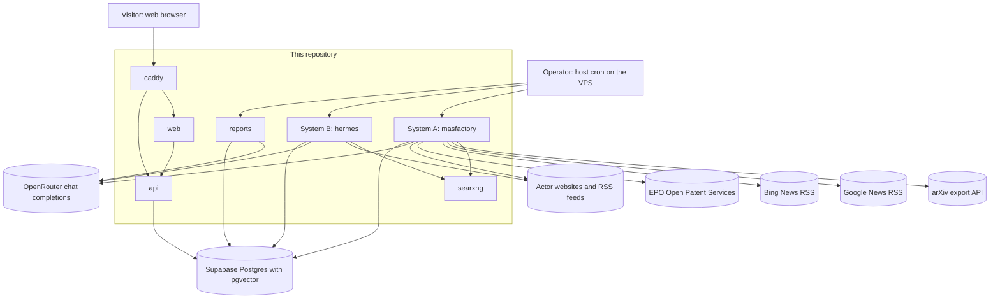
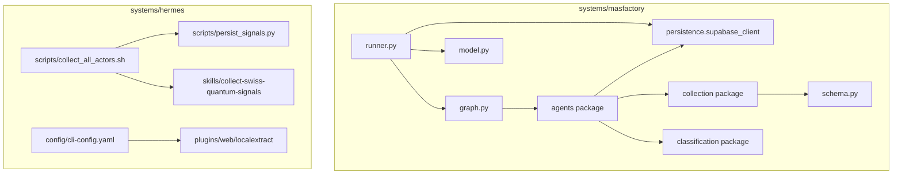
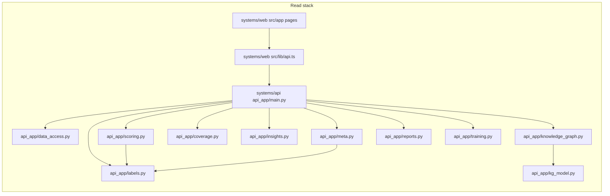
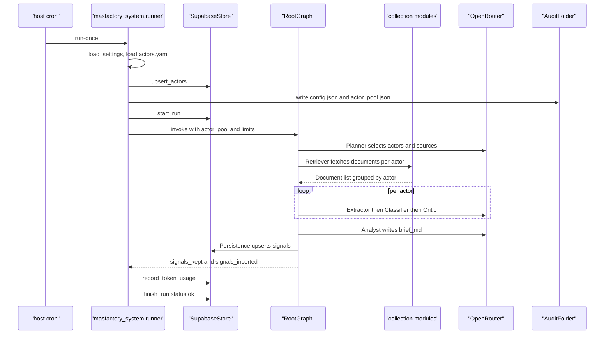
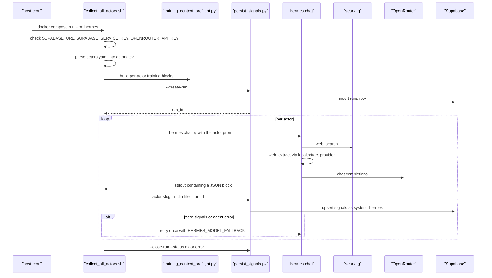
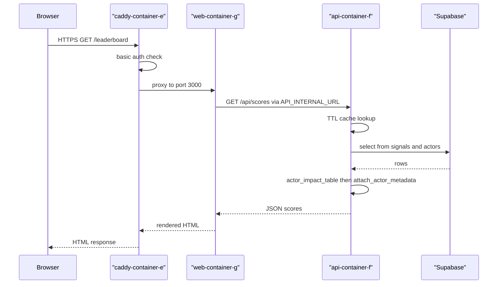
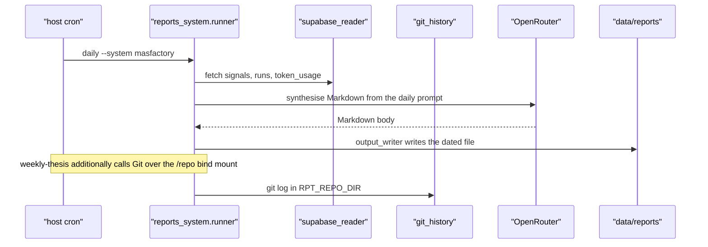
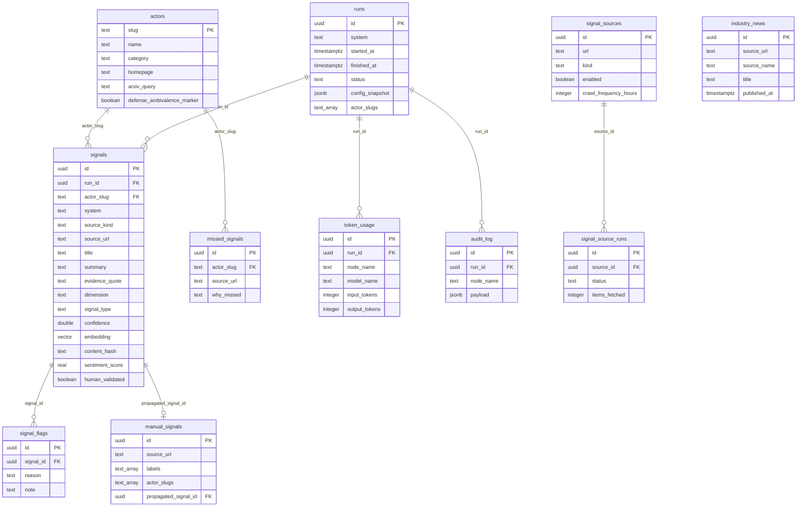
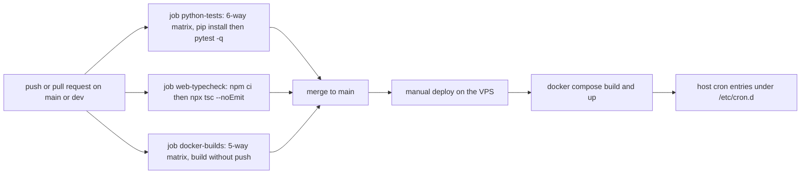

# mas-deeptech-research

Two independently architected multi-agent systems harvest public signals about the Swiss quantum-computing ecosystem into one shared Postgres database, and a read-only web stack presents the result. System A is an orchestrated node graph built on the `masfactory` library; System B is the upstream NousResearch Hermes Agent CLI driven by a project-specific skill file. Both process the same 40-actor list from [data/raw/actors.yaml](data/raw/actors.yaml), classify findings against the same YAML taxonomy in [classification/schema.yaml](systems/masfactory/masfactory_system/classification/schema.yaml), and write to the same tables defined in [persistence/schema.sql](systems/masfactory/masfactory_system/persistence/schema.sql). The repository is the software artefact of a BSc thesis (Anna Geiser, FHNW); the intended readers are the thesis examiner and anyone reproducing the comparison.

## Scope

In scope:

- Two signal-producing systems, each packaged as a container that runs once per host cron tick and exits.
- A report generator that synthesises daily and weekly Markdown from the database and the git log.
- A read-only JSON API and a Next.js frontend over the same database.
- An offline evaluation harness computing four metrics plus a REFI-QDA round-trip for manual coding.
- A shared self-hosted SearXNG meta-search service used by both producers.

Not in scope, and absent from this repository:

- The Postgres database itself. Supabase is an external hosted service; [persistence/schema.sql](systems/masfactory/masfactory_system/persistence/schema.sql) is applied by hand in the Supabase SQL editor and no container performs DDL at startup ([schema.sql:3-4](systems/masfactory/masfactory_system/persistence/schema.sql:3)).
- The Hermes agent implementation. `systems/hermes/upstream` is a git submodule pointing at `https://github.com/NousResearch/hermes-agent.git` ([.gitmodules:1-3](.gitmodules:1)), and the runtime image is pulled from Docker Hub rather than built from it ([systems/hermes/Dockerfile:28](systems/hermes/Dockerfile:28)).
- Any thesis text. Only the software and its engineering documentation are here.
- A license file. `README.md` previously linked one; it was removed in commit `16d0156` and no replacement exists.
- Authentication and authorisation inside the applications. The only access control is HTTP basic auth at the reverse proxy ([caddy/Caddyfile:30-37](caddy/Caddyfile:30)), and the committed password hash is a placeholder.

## System overview



Node evidence: the seven repository components are the `services:` entries in [docker-compose.yml:14-266](docker-compose.yml:14) plus the profile-gated `phoenix` service, which is omitted from this diagram because it is off by default. The external collectors are the modules in [masfactory_system/collection/](systems/masfactory/masfactory_system/collection).

## Technology stack

Python dependency versions below are the lower bounds declared in each `pyproject.toml`. No Python lockfile of any kind exists in the repository, so exact resolved versions cannot be stated. Node versions are exact because [systems/web/package-lock.json](systems/web/package-lock.json) is committed at lockfileVersion 3.

| Layer | Technology | Resolved version | Source file that pins it |
|---|---|---|---|
| Producer A orchestration | masfactory | `==1.0.3` (exact) | [systems/masfactory/pyproject.toml:8](systems/masfactory/pyproject.toml:8) |
| Producer A runtime | Python | `>=3.11`, image `python:3.11-slim` | [systems/masfactory/pyproject.toml:6](systems/masfactory/pyproject.toml:6), [systems/masfactory/Dockerfile:3](systems/masfactory/Dockerfile:3) |
| Producer A HTML parsing | selectolax | `>=0.3.21` | [systems/masfactory/pyproject.toml:11](systems/masfactory/pyproject.toml:11) |
| Producer A embeddings | fastembed | `>=0.4.0` | [systems/masfactory/pyproject.toml:21](systems/masfactory/pyproject.toml:21) |
| Producer A structured output | instructor, pydantic | `>=1.6.0`, `>=2.7.0` | [systems/masfactory/pyproject.toml:26](systems/masfactory/pyproject.toml:26), [systems/masfactory/pyproject.toml:14](systems/masfactory/pyproject.toml:14) |
| Producer A sentiment | vaderSentiment | `>=3.3.2` | [systems/masfactory/pyproject.toml:29](systems/masfactory/pyproject.toml:29) |
| Producer A tracing | arize-phoenix-otel, openinference-instrumentation-openai | `>=0.6.0`, `>=0.1.18` | [systems/masfactory/pyproject.toml:36-37](systems/masfactory/pyproject.toml:36) |
| Producer B agent | nousresearch/hermes-agent Docker image | tag `v2026.6.5`, digest `sha256:9ad3b04e...` | [systems/hermes/Dockerfile:28](systems/hermes/Dockerfile:28) |
| Producer B wrapper | httpx, selectolax | `>=0.27`, `>=0.3` | [systems/hermes/pyproject.toml:12-18](systems/hermes/pyproject.toml:12) |
| Producer B source reference | NousResearch/hermes-agent submodule | commit `ba44de06d` | [.gitmodules:1-3](.gitmodules:1) |
| Reports LLM client | openai | `>=1.50.0` | [systems/reports/pyproject.toml:8](systems/reports/pyproject.toml:8) |
| API framework | fastapi, uvicorn | `>=0.115.0`, `>=0.30.0` | [systems/api/pyproject.toml:8-9](systems/api/pyproject.toml:8) |
| API data handling | pandas, networkx | `>=2.2.0`, `>=3.3` | [systems/api/pyproject.toml:11-12](systems/api/pyproject.toml:11) |
| Database client (all Python) | supabase | `>=2.7.0` | six `pyproject.toml` files |
| Evaluation metrics | scikit-learn | `>=1.4.0` | [systems/evaluation/pyproject.toml:11](systems/evaluation/pyproject.toml:11) |
| Frontend framework | next | `14.2.15` | [systems/web/package.json:13](systems/web/package.json:13) |
| Frontend runtime | react, react-dom | `18.3.1`, `18.3.1` | [systems/web/package.json:14-15](systems/web/package.json:14) |
| Frontend charts | recharts | `2.12.7` | [systems/web/package.json:16](systems/web/package.json:16) |
| Frontend data fetching | swr | `2.2.5` | [systems/web/package.json:17](systems/web/package.json:17) |
| Frontend types | typescript | `5.5.3` | [systems/web/package.json:23](systems/web/package.json:23) |
| Frontend image base | node | `20-slim` | [systems/web/Dockerfile:4](systems/web/Dockerfile:4) |
| Reverse proxy | caddy | `2.10-alpine` | [docker-compose.yml:183](docker-compose.yml:183) |
| Meta-search | searxng/searxng | digest `sha256:02aa607e...` | [docker-compose.yml:247](docker-compose.yml:247) |
| Tracing server | arizephoenix/phoenix | `latest` (unpinned) | [docker-compose.yml:221](docker-compose.yml:221) |
| CI runner | ubuntu-latest, Python 3.11, Node 20 | see workflow | [.github/workflows/ci.yml:25-77](.github/workflows/ci.yml:25) |

## Architecture

### Component and module dependency



Edge evidence: [runner.py:20-26](systems/masfactory/masfactory_system/runner.py:20), [graph.py:39-57](systems/masfactory/masfactory_system/graph.py:39), [retriever.py:16-26](systems/masfactory/masfactory_system/agents/retriever.py:16), [agents/persistence.py:26-31](systems/masfactory/masfactory_system/agents/persistence.py:26), [collect_all_actors.sh:35](systems/hermes/scripts/collect_all_actors.sh:35), [cli-config.yaml:147-149](systems/hermes/config/cli-config.yaml:147).



Edge evidence: [main.py:18-27](systems/api/api_app/main.py:18), [scoring.py:18-24](systems/api/api_app/scoring.py:18), [meta.py:15-17](systems/api/api_app/meta.py:15), [api.ts:42-86](systems/web/src/lib/api.ts:42).

### Layering

| Layer | Members | Responsibility |
|---|---|---|
| Producers | `systems/masfactory`, `systems/hermes` | Fetch public documents, classify them into signals, write to Supabase. Each exits after one pass. |
| Shared retrieval substrate | `searxng` compose service, [searxng/settings.yml](searxng/settings.yml) | One meta-search JSON endpoint that both producers query, so the comparison varies orchestration rather than search source. |
| Synthesis | `systems/reports` | Reads Supabase and the bind-mounted git repository, calls OpenRouter, writes Markdown to `data/reports/`. |
| Read API | `systems/api` | Read-only JSON over Supabase plus computed scores. Also serves generated report Markdown from disk. |
| Presentation | `systems/web`, `caddy` | Server-rendered React pages and TLS termination. |
| Offline analysis | `systems/evaluation` | Metric computation and REFI-QDA export and import. Never containerised. |

### Module responsibilities

**systems/masfactory** ([README](systems/masfactory/README.md))

| Module | Responsibility |
|---|---|
| `runner.py` | Argparse CLI with `run-once` and `build-check`. Loads actors, opens a `runs` row, invokes the graph, records token usage, closes the run. |
| `graph.py` | Declares the `RootGraph`: Planner, Retriever, a per-actor `Loop`, Analyst, Persistence. Chooses among three Critic wirings based on environment variables. |
| `agents/` | One module per node. `planner`, `extractor`, `classifier`, `critic`, `analyst` are LLM Agents; `retriever`, `loop_nodes`, `reranker_prefilter`, `persistence`, `survivor` are pure-Python CustomNodes. |
| `collection/` | Seven collectors: `arxiv`, `website`, `news`, `press`, `patents`, `rss`, `websearch`. Each returns `Document` models and swallows its own network errors. |
| `classification/` | Loads and caches [schema.yaml](systems/masfactory/masfactory_system/classification/schema.yaml), which declares 4 signal types, 19 dimensions, 2 channels, 2 signal flags. |
| `persistence/` | Supabase client wrapper plus the canonical `schema.sql`. |
| `model.py` | Builds the OpenRouter-backed model with a failover wrapper onto the fallback model. |
| `embedding.py`, `reranker.py`, `sentiment.py`, `structured_output.py`, `observability.py` | Five optional layers, each behind an environment gate, each degrading to a no-op when its dependency or key is absent. |
| `training_layer.py` | Reads the editorial `manual_signals` and `signal_sources` tables over PostgREST. |
| `scripts/sync_manual_signals.py` | Standalone propagation of curated manual signals into `public.signals` as `system='manual'`. |

**systems/hermes** ([README](systems/hermes/README.md))

| Module | Responsibility |
|---|---|
| `scripts/collect_all_actors.sh` | Container CMD. Reads `actors.yaml`, creates the `runs` row, loops actors, invokes `hermes chat -q`, retries once with the fallback model on empty or failed output, closes the run. |
| `scripts/persist_signals.py` | Three modes selected by flag: `--create-run`, `--close-run`, and per-actor persist. Strips reasoning-token wrappers from agent stdout before JSON extraction. |
| `scripts/training_context_preflight.py` | Materialises per-actor editorial context files consumed by the prompt loop. |
| `scripts/backfill_embeddings.py`, `scripts/backfill_sentiment.py` | One-shot maintenance jobs over existing rows. Not invoked by cron. |
| `scripts/patch_web_tools_backend.py` | Build-time patch appending a wrapper to the upstream `tools.web_tools._is_backend_available`, which hardcodes backend names and would otherwise reject `localextract`. |
| `plugins/web/localextract/` | A web-extract provider using httpx plus selectolax, installed into the image's bundled plugin directory. |
| `skills/collect-swiss-quantum-signals/SKILL.md` | The methodology and JSON output contract handed to the agent. |
| `config/cli-config.yaml` | Model, auxiliary-model pinning, toolset restriction, search and extract backends, turn and compression limits. |

**systems/api** ([README](systems/api/README.md)) exposes 26 routes over a TTL-cached Supabase reader. `scoring.py` computes the six actor metrics; `labels.py` holds the vendored taxonomy label maps; `knowledge_graph.py` and `kg_model.py` build a node-and-edge JSON graph; `insights.py` serves the persona lens; `coverage.py` aggregates source-mix and gap tables; `training.py` implements the manual-signal and source CRUD; `selfcheck.py` is the build-time import smoke test invoked from the Dockerfile.

**systems/reports** ([README](systems/reports/README.md)) has one module per report kind (`daily`, `weekly_system`, `weekly_thesis`), a `supabase_reader`, a `git_history` reader shelling out to `git log`, a `prompt_loader` reading [prompts/](systems/reports/prompts), an `openrouter` client, and an `output_writer`. `industry_news_runner.py` is a separate self-contained entry point.

**systems/web** uses the Next.js App Router. 17 page routes under `src/app`, 7 components under `src/components`, and 4 library modules under `src/lib`. Server components fetch through `src/lib/api.ts` against `API_INTERNAL_URL`; the interactive pages (`labels`, `sources`, `signals`, `reports`, `quantum-news`) fetch relative `/api/*` from the browser, which the Next.js rewrite in [next.config.mjs:8-11](systems/web/next.config.mjs:8) and the Caddy `handle` block both route to the API container.

**systems/evaluation** ([README](systems/evaluation/README.md)) provides `eval_app.runner` with four metrics and a `dump` mode, plus `eval_app.qda` implementing a REFI-QDA `.qdpx` export and import round trip with Cohen kappa comparison.

## Runtime behaviour

### System A daily collection



Evidence: [runner.py:47-169](systems/masfactory/masfactory_system/runner.py:47) and [graph.py:279-304](systems/masfactory/masfactory_system/graph.py:279).

### System B daily collection



Evidence: [collect_all_actors.sh:44-384](systems/hermes/scripts/collect_all_actors.sh:44).

### Browser page load



Evidence: [caddy/Caddyfile:30-45](caddy/Caddyfile:30), [api.ts:19-31](systems/web/src/lib/api.ts:19), [main.py:155-159](systems/api/api_app/main.py:155), [scoring.py:31-79](systems/api/api_app/scoring.py:31), [data_access.py:26-40](systems/api/api_app/data_access.py:26).

### Report generation



Evidence: [reports_system/runner.py:12-56](systems/reports/reports_system/runner.py:12), [git_history.py:31](systems/reports/reports_system/git_history.py:31), [docker-compose.yml:141-146](docker-compose.yml:141).

## Data model and data flow

All persistence is in one external Supabase Postgres schema, defined in [persistence/schema.sql](systems/masfactory/masfactory_system/persistence/schema.sql). The `vector` and `pgcrypto` extensions are required ([schema.sql:6-7](systems/masfactory/masfactory_system/persistence/schema.sql:6)).



`industry_news` carries no foreign key because it holds worldwide news not attributed to any actor ([schema.sql:323-337](systems/masfactory/masfactory_system/persistence/schema.sql:323)).

Additional database objects, all in the same file:

- View `public.false_positives_recent` joining `signal_flags` to `signals` over a 90-day window ([schema.sql:313-320](systems/masfactory/masfactory_system/persistence/schema.sql:313)).
- Function `public.find_similar_signals(text, vector, integer, integer)` returning cosine-similarity neighbours, used by the optional semantic-dedup path ([schema.sql:378-409](systems/masfactory/masfactory_system/persistence/schema.sql:378)).
- Function `public._touch_updated_at()` with triggers on `manual_signals` and `signal_sources` ([schema.sql:556-572](systems/masfactory/masfactory_system/persistence/schema.sql:556)).
- An `ivfflat` index over `signals.embedding`, created only once non-null embeddings exist ([schema.sql:124-137](systems/masfactory/masfactory_system/persistence/schema.sql:124)).

Serialisation formats at process boundaries:

| Boundary | Format | Defined in |
|---|---|---|
| Collectors to graph attributes | `Document` Pydantic model dumped to JSON | [schema.py](systems/masfactory/masfactory_system/schema.py) |
| Agent nodes to each other | JSON strings inside graph attributes | [graph.py:60-109](systems/masfactory/masfactory_system/graph.py:60) |
| Classifier to persistence | `ClassifiedSignal` Pydantic model | [structured_output.py:33-34](systems/masfactory/masfactory_system/structured_output.py:33) |
| Hermes agent to persister | a JSON block embedded in stdout | [SKILL.md](systems/hermes/skills/collect-swiss-quantum-signals/SKILL.md), [persist_signals.py](systems/hermes/scripts/persist_signals.py) |
| API to frontend | JSON, typed on the client | [systems/web/src/lib/types.ts](systems/web/src/lib/types.ts) |
| Reports to disk | Markdown files under `data/reports/` | [output_writer.py](systems/reports/reports_system/output_writer.py) |
| Audit trail | JSON files under `MASF_AUDIT_DIR` | [audit.py](systems/masfactory/masfactory_system/audit.py) |
| Evaluation export | REFI-QDA `.qdpx` archive | [refi_qda.py](systems/evaluation/eval_app/qda/refi_qda.py) |

## Repository layout

```
.
├── .env.example                 Documented template for the .env that docker compose reads
├── .github/workflows/ci.yml     Three CI jobs: pytest matrix, tsc, docker build matrix
├── .gitmodules                  Declares systems/hermes/upstream as a submodule
├── .mcp.json                    Editor-side MCP server config; not used at runtime
├── caddy/Caddyfile              TLS, basic auth, and the two proxy routes
├── data/raw/                    Bind-mounted input: actors.yaml (40 actors), rss_feeds.yaml (7 feeds)
├── docker-compose.yml           Seven active services plus one profile-gated tracing service
├── docs/                        24 topic documents plus an indexed set of dated iteration records under docs/iterations/
├── searxng/settings.yml         Committed SearXNG configuration, JSON output enabled
└── systems/
    ├── api/                     FastAPI read service, 26 routes
    ├── evaluation/              Offline metric harness and REFI-QDA round trip; no container
    ├── hermes/                  System B wrapper, plugin, skill, and config around the upstream image
    ├── masfactory/              System A graph, collectors, taxonomy, and canonical SQL schema
    ├── reports/                 Daily and weekly Markdown generation
    └── web/                     Next.js 14 App Router frontend, 17 routes
```

## Configuration reference

Every key below is read by name in the file cited. Keys marked required raise or exit when absent.

### Shared

| Key | Type | Required | Default | Consumed by |
|---|---|---|---|---|
| `OPENROUTER_API_KEY` | string | yes | none | [masfactory config.py:90](systems/masfactory/masfactory_system/config.py:90), [reports config.py:60](systems/reports/reports_system/config.py:60), [collect_all_actors.sh:45](systems/hermes/scripts/collect_all_actors.sh:45) |
| `OPENROUTER_BASE_URL` | string | no | `https://openrouter.ai/api/v1` | [masfactory config.py:101](systems/masfactory/masfactory_system/config.py:101), [reports config.py:66](systems/reports/reports_system/config.py:66) |
| `OPENROUTER_HTTP_REFERER` | string | no | `https://github.com/anna-geiser/mas-deeptech-research` | [masfactory config.py:115](systems/masfactory/masfactory_system/config.py:115) |
| `OPENROUTER_APP_TITLE` | string | no | `MASFactory System A (BSc thesis)` in A, `Reports (BSc thesis)` in C | [masfactory config.py:117](systems/masfactory/masfactory_system/config.py:117), [reports config.py:86](systems/reports/reports_system/config.py:86) |
| `SUPABASE_URL` | string | yes for A, B, C, evaluation; optional for api | empty | [masfactory config.py:96](systems/masfactory/masfactory_system/config.py:96), [api config.py:27](systems/api/api_app/config.py:27), [persist_signals.py:400](systems/hermes/scripts/persist_signals.py:400) |
| `SUPABASE_SERVICE_KEY` | string | same as above | empty | [masfactory config.py:97](systems/masfactory/masfactory_system/config.py:97), [api config.py:28](systems/api/api_app/config.py:28) |
| `SEARXNG_URL` | string | no | empty in code, `http://searxng:8080` in compose | [masfactory config.py:112](systems/masfactory/masfactory_system/config.py:112), [docker-compose.yml:29](docker-compose.yml:29) |
| `TZ` | string | no | `Europe/Zurich` set per service | [docker-compose.yml:30](docker-compose.yml:30) |

### System A

| Key | Type | Required | Default | Consumed by |
|---|---|---|---|---|
| `MASF_MODEL_MAIN` | string | no | `nvidia/nemotron-3-ultra-550b-a55b:free` | [config.py:20](systems/masfactory/masfactory_system/config.py:20) |
| `MASF_MODEL_FALLBACK` | string | no | `qwen/qwen3-next-80b-a3b-instruct:free` | [config.py:21](systems/masfactory/masfactory_system/config.py:21) |
| `MASF_REASONING_EXCLUDE` | boolean | no | true | [config.py:118](systems/masfactory/masfactory_system/config.py:118) |
| `MASF_LIMIT_ACTORS` | integer | no | 3 | [config.py:108](systems/masfactory/masfactory_system/config.py:108) |
| `MASF_LIMIT_ARXIV` | integer | no | 10 | [config.py:109](systems/masfactory/masfactory_system/config.py:109) |
| `MASF_LIMIT_WEBSITE` | integer | no | 5 | [config.py:110](systems/masfactory/masfactory_system/config.py:110) |
| `MASF_LIMIT_NEWS` | integer | no | 10 | [config.py:111](systems/masfactory/masfactory_system/config.py:111) |
| `MASF_LIMIT_WEBSEARCH` | integer | no | 10 | [config.py:113](systems/masfactory/masfactory_system/config.py:113) |
| `MASF_AUDIT_DIR` | string | no | `/data/raw/runs` | [config.py:114](systems/masfactory/masfactory_system/config.py:114) |
| `MASF_SIGNAL_MAX_AGE_DAYS` | integer | no | 180 | [collection/news.py:46](systems/masfactory/masfactory_system/collection/news.py:46) |
| `MASF_RSS_FEEDS_PATH` | string | no | falls back to `/data/raw/rss_feeds.yaml` | [collection/rss.py:51](systems/masfactory/masfactory_system/collection/rss.py:51) |
| `MASF_EMBEDDINGS` | boolean | no | off | [embedding.py:55](systems/masfactory/masfactory_system/embedding.py:55) |
| `MASF_SEMANTIC_DEDUP` | boolean | no | off | [agents/persistence.py:41](systems/masfactory/masfactory_system/agents/persistence.py:41) |
| `MASF_SEMANTIC_DEDUP_THRESHOLD` | float | no | 0.92, clamped to 0.5 through 0.999 | [agents/persistence.py:45](systems/masfactory/masfactory_system/agents/persistence.py:45) |
| `MASF_SEMANTIC_DEDUP_DAYS` | integer | no | 90, clamped to 1 through 365 | [agents/persistence.py:49](systems/masfactory/masfactory_system/agents/persistence.py:49) |
| `MASF_CRITIC_CONSENSUS_PASSES` | integer | no | 1; any value above 1 becomes 3 | [agents/critic_consensus.py:88](systems/masfactory/masfactory_system/agents/critic_consensus.py:88) |
| `MASF_CRITIC_DEBATE_ROUNDS` | integer | no | 0; any value above 0 becomes 1 | [agents/critic_debate.py:99](systems/masfactory/masfactory_system/agents/critic_debate.py:99) |
| `MASF_RERANKER` | boolean | no | off | [reranker.py:48](systems/masfactory/masfactory_system/reranker.py:48) |
| `MASF_RERANKER_MODEL` | string | no | `Xenova/ms-marco-MiniLM-L-6-v2` | [reranker.py:39](systems/masfactory/masfactory_system/reranker.py:39) |
| `MASF_RERANKER_THRESHOLD` | float | no | 0.0, clamped to -10 through 10 | [reranker.py:60](systems/masfactory/masfactory_system/reranker.py:60) |
| `MASF_SENTIMENT` | boolean | no | on | [sentiment.py:44](systems/masfactory/masfactory_system/sentiment.py:44) |
| `MASF_INSTRUCTOR_REPAIR` | boolean | no | off | [structured_output.py:38](systems/masfactory/masfactory_system/structured_output.py:38) |
| `EPO_OPS_CONSUMER_KEY` | string | no | unset means the patent collector returns an empty list | [collection/patents.py:105](systems/masfactory/masfactory_system/collection/patents.py:105) |
| `EPO_OPS_CONSUMER_SECRET` | string | no | as above | [collection/patents.py:106](systems/masfactory/masfactory_system/collection/patents.py:106) |
| `PHOENIX_ENABLED` | boolean | no | off | [observability.py:70](systems/masfactory/masfactory_system/observability.py:70) |
| `PHOENIX_COLLECTOR_ENDPOINT` | string | no | `http://phoenix:6006/v1/traces` | [observability.py:60](systems/masfactory/masfactory_system/observability.py:60) |
| `PHOENIX_PROJECT_NAME` | string | no | `masfactory-swiss-quantum` | [observability.py:61](systems/masfactory/masfactory_system/observability.py:61) |

### System B

| Key | Type | Required | Default | Consumed by |
|---|---|---|---|---|
| `HERMES_HOME` | string | no | `/opt/data` | [seed-hermes-home.sh:21](systems/hermes/scripts/seed-hermes-home.sh:21), [collect_all_actors.sh:34](systems/hermes/scripts/collect_all_actors.sh:34) |
| `HERMES_MODEL` | string | no | `nvidia/nemotron-3-ultra-550b-a55b:free` | [collect_all_actors.sh:279](systems/hermes/scripts/collect_all_actors.sh:279) |
| `HERMES_MODEL_FALLBACK` | string | no | `qwen/qwen3-next-80b-a3b-instruct:free` | [collect_all_actors.sh:280](systems/hermes/scripts/collect_all_actors.sh:280) |
| `HERMES_LIMIT_ACTORS` | integer | no | 0, meaning all actors | [collect_all_actors.sh:32](systems/hermes/scripts/collect_all_actors.sh:32) |
| `HERMES_LOOKBACK_DAYS` | integer | no | 180 | [collect_all_actors.sh:33](systems/hermes/scripts/collect_all_actors.sh:33) |
| `HERMES_TOOL_STATUS` | string | set by the script | `searxng+localextract` or `paid+localextract` | [collect_all_actors.sh:67-73](systems/hermes/scripts/collect_all_actors.sh:67) |
| `HERMES_IMAGE_TAG` | string | no | recorded into `runs.config_snapshot` | [persist_signals.py:428](systems/hermes/scripts/persist_signals.py:428), [docker-compose.yml:72](docker-compose.yml:72) |
| `HRM_EMBEDDINGS` | boolean | no | off | [persist_signals.py:59](systems/hermes/scripts/persist_signals.py:59) |
| `HRM_SENTIMENT` | boolean | no | on | [persist_signals.py:109](systems/hermes/scripts/persist_signals.py:109) |
| `TAVILY_API_KEY`, `EXA_API_KEY`, `BRAVE_SEARCH_API_KEY`, `FIRECRAWL_API_KEY`, `FIRECRAWL_API_URL`, `PARALLEL_API_KEY` | string | no | unset selects the free SearXNG plus localextract path | [collect_all_actors.sh:67](systems/hermes/scripts/collect_all_actors.sh:67), [docker-compose.yml:109-114](docker-compose.yml:109) |
| `ACTORS_FILE` | string | no | `/data/raw/actors.yaml` | [collect_all_actors.sh:31](systems/hermes/scripts/collect_all_actors.sh:31) |

`HRM_LIMIT_ACTORS`, `HRM_MAX_ITERATIONS`, `HRM_SEMANTIC_DEDUP`, `HRM_SEMANTIC_DEDUP_THRESHOLD` and `HRM_SEMANTIC_DEDUP_DAYS` appear in [.env.example](.env.example) but no source file in this repository reads them. See Known limitations.

### Reports, API, evaluation

| Key | Type | Required | Default | Consumed by |
|---|---|---|---|---|
| `RPT_MODEL_MAIN` | string | no | falls back to `MASF_MODEL_MAIN`, then `nvidia/nemotron-3-ultra-550b-a55b:free` | [reports config.py:68-72](systems/reports/reports_system/config.py:68) |
| `RPT_MODEL_FALLBACK` | string | no | falls back to `MASF_MODEL_FALLBACK` | [reports config.py:73-77](systems/reports/reports_system/config.py:73) |
| `RPT_REASONING_EXCLUDE` | boolean | no | falls back to `MASF_REASONING_EXCLUDE`, then true | [reports config.py:87-90](systems/reports/reports_system/config.py:87) |
| `RPT_REPORTS_DIR` | string | no | `/data/reports` | [reports config.py:80](systems/reports/reports_system/config.py:80) |
| `RPT_REPO_DIR` | string | no | `/repo` | [reports config.py:81](systems/reports/reports_system/config.py:81) |
| `RPT_THESIS_NOTES_PATH` | string | no | `/data/raw/thesis_notes.md` | [reports config.py:82](systems/reports/reports_system/config.py:82) |
| `RPT_RSS_FEEDS_PATH` | string | no | falls back to `MASF_RSS_FEEDS_PATH`, then `/data/raw/rss_feeds.yaml` | [industry_news_runner.py:44](systems/reports/reports_system/industry_news_runner.py:44) |
| `API_REPORTS_DIR` | string | no | `/data/reports` | [api config.py:29](systems/api/api_app/config.py:29) |
| `API_SCHEMA_PATH` | string | no | `/app/schema.yaml` | [api config.py:30-32](systems/api/api_app/config.py:30) |
| `API_CACHE_TTL` | integer | no | 60 | [api config.py:33](systems/api/api_app/config.py:33) |
| `API_CORS_ORIGINS` | string | no | `*` | [api config.py:24](systems/api/api_app/config.py:24) |
| `API_INTERNAL_URL` | string | no | `http://api:8000` in code, `http://api-container-f:8000` in compose | [next.config.mjs:9](systems/web/next.config.mjs:9), [api.ts:19](systems/web/src/lib/api.ts:19), [docker-compose.yml:175](docker-compose.yml:175) |
| `EVAL_WINDOW_DAYS` | integer | no | 90 | [eval config.py:36](systems/evaluation/eval_app/config.py:36) |
| `EVAL_OUTPUT_DIR` | string | no | `data/eval` | [eval config.py:37](systems/evaluation/eval_app/config.py:37) |
| `EVAL_GOLD_PATH` | string | no | `data/gold/labels.yaml` | [eval config.py:38](systems/evaluation/eval_app/config.py:38) |
| `EVAL_GOLD_SEED` | string | no | read when sampling the QDA export | [qda/exporter.py:99](systems/evaluation/eval_app/qda/exporter.py:99) |

## Installation, build, execution, and test

### Prerequisites

A Supabase project with [persistence/schema.sql](systems/masfactory/masfactory_system/persistence/schema.sql) applied by hand, an OpenRouter API key, Docker with the Compose plugin, and Python 3.11 with Node 20 for the local paths.

### Clone and configure

```bash
git clone https://github.com/annageiser/mas-deeptech-research.git
```

```bash
git submodule update --init --depth 1 systems/hermes/upstream
```

```bash
cp .env.example .env
```

Edit `.env` and set at minimum `OPENROUTER_API_KEY`, `SUPABASE_URL`, and `SUPABASE_SERVICE_KEY`.

Before exposing the site, replace the placeholder in [caddy/Caddyfile:32](caddy/Caddyfile:32) and inject a real SearXNG secret over the placeholder in [searxng/settings.yml:24](searxng/settings.yml:24).

### Build

```bash
docker compose build
```

Each Dockerfile ends with a build-time self-check: [masfactory/Dockerfile:33](systems/masfactory/Dockerfile:33) compiles the graph, [reports/Dockerfile:39](systems/reports/Dockerfile:39) loads the prompts, [api/Dockerfile:30](systems/api/Dockerfile:30) runs `api_app.selfcheck`, [hermes/Dockerfile:74-87](systems/hermes/Dockerfile:74) asserts the localextract provider and backend shim, and [web/Dockerfile:19](systems/web/Dockerfile:19) checks the build context before `npm run build`.

### Run

```bash
docker compose up -d searxng api web caddy
```

```bash
docker compose run --rm masfactory run-once --limit-actors 2
```

```bash
HERMES_LIMIT_ACTORS=2 HERMES_LOOKBACK_DAYS=60 docker compose run --rm hermes
```

```bash
docker compose run --rm reports daily --system masfactory
```

Optional tracing, behind the `observability` compose profile:

```bash
docker compose --profile observability up -d phoenix
```

Scheduling is host cron, not a daemon inside any image. The three sample files install as follows:

```bash
sudo cp systems/masfactory/crontab.sample /etc/cron.d/masfactory
```

```bash
sudo cp systems/hermes/crontab.sample /etc/cron.d/mas-deeptech-research-hermes
```

```bash
sudo cp systems/reports/crontab.sample /etc/cron.d/reports
```

Schedules as written, all interpreted with `CRON_TZ=Europe/Zurich`:

| Time | Entry | Action |
|---|---|---|
| 02:00 daily | [masfactory/crontab.sample:25](systems/masfactory/crontab.sample:25) | System A run, then the System A daily report |
| 05:00 daily | [hermes/crontab.sample:35](systems/hermes/crontab.sample:35) | System B run, then the System B daily report |
| 08:00 Sunday | [reports/crontab.sample:20](systems/reports/crontab.sample:20) | Three weekly reports in sequence |

### Test

Each Python package installs and tests the same way. Substitute any of `masfactory`, `hermes`, `reports`, `api`, `evaluation` for `<system>`:

```bash
python3.11 -m venv .venv-<system> && ./.venv-<system>/bin/pip install ./systems/<system> pytest
```

```bash
cd systems/<system> && pytest -q
```

This matches the CI steps at [.github/workflows/ci.yml:57-66](.github/workflows/ci.yml:57). Results observed on 2026-08-02 with Python 3.11.15, after the fixes described below:

| Package | Outcome |
|---|---|
| masfactory | 219 passed |
| api | 49 passed, 3 xfailed |
| hermes | 50 passed |
| evaluation | 50 passed |
| reports | 12 passed |

Frontend type check, matching [.github/workflows/ci.yml:81-87](.github/workflows/ci.yml:81):

```bash
cd systems/web && npm ci --no-audit --no-fund --include=dev
```

```bash
cd systems/web && npx tsc --noEmit
```

Observed outcome: exit code 0 with no diagnostics.

No linter is configured. `npm run lint` is declared at [package.json:10](systems/web/package.json:10) but no ESLint configuration file exists in the repository, and no CI job invokes it.

## Interface reference

### HTTP endpoints

All served by [systems/api/api_app/main.py](systems/api/api_app/main.py) and reachable through Caddy under the same paths.

| Method | Path | Purpose |
|---|---|---|
| GET | `/api/health` | Liveness plus whether Supabase credentials are present |
| GET | `/api/meta` | The classification taxonomy and its literature references |
| GET | `/api/actors` | Actor roster |
| GET | `/api/signals` | Signal list with filters for system, days, actor, signal type, dimension, source kind, minimum confidence, limit |
| GET | `/api/scores` | Per-actor metric table |
| GET | `/api/ecosystem` | Ecosystem-level aggregates |
| GET | `/api/signalling` | Signalling-theory breakdown |
| GET | `/api/coverage` | Source mix, weekly throughput, and zero-signal actor gaps |
| GET | `/api/insights` | Persona-lens payload |
| GET | `/api/actor/{slug}` | Single-actor detail |
| GET | `/api/compare` | System A against System B |
| GET | `/api/knowledge-graph` | Node and edge JSON with optional taxonomy and semantic layers |
| GET | `/api/industry-news` | Rows from `public.industry_news` |
| GET | `/api/reports` | Report index, or one report body when `file` is supplied |
| GET | `/api/signal-flags` | Flag list |
| POST | `/api/signal-flags` | Record a wrong-signal or correct-example flag |
| GET | `/api/manual-signals` | Curated manual signals |
| GET | `/api/manual-signals/{signal_id}` | One curated signal |
| POST | `/api/manual-signals` | Create |
| PATCH | `/api/manual-signals/{signal_id}` | Update |
| DELETE | `/api/manual-signals/{signal_id}` | Delete |
| GET | `/api/sources` | Managed RSS and URL sources |
| GET | `/api/sources/{source_id}` | One source |
| POST | `/api/sources` | Create |
| PATCH | `/api/sources/{source_id}` | Update |
| DELETE | `/api/sources/{source_id}` | Delete |

The CORS middleware allows only `GET` ([main.py:42](systems/api/api_app/main.py:42)), so the six mutating routes are reachable from the same origin through the Caddy or Next.js proxy but not cross-origin.

### Frontend routes

17 page routes, all under [systems/web/src/app](systems/web/src/app): `/`, `/actors`, `/actors/[slug]`, `/compare`, `/coverage`, `/ecosystem`, `/graph`, `/labels`, `/leaderboard`, `/methodology`, `/personas`, `/personas/[id]`, `/quantum-news`, `/reports`, `/signalling`, `/signals`, `/sources`. Fifteen appear in the sidebar defined at [Nav.tsx:6-47](systems/web/src/components/Nav.tsx:6); the two dynamic routes are reached from their index pages.

### Command-line entry points

| Command | Defined at |
|---|---|
| `masfactory-run` console script, and `python -m masfactory_system.runner {run-once,build-check}` | [masfactory/pyproject.toml:41](systems/masfactory/pyproject.toml:41), [runner.py:239](systems/masfactory/masfactory_system/runner.py:239) |
| `/app/entrypoint.sh {run-once,build-check,shell}` | [masfactory/entrypoint.sh](systems/masfactory/entrypoint.sh) |
| `python -m masfactory_system.scripts.sync_manual_signals` | [sync_manual_signals.py:17](systems/masfactory/masfactory_system/scripts/sync_manual_signals.py:17) |
| `reports-run` console script, and `python -m reports_system.runner {daily,weekly,weekly-thesis,build-check}` | [reports/pyproject.toml:19](systems/reports/pyproject.toml:19), [reports/runner.py:59](systems/reports/reports_system/runner.py:59) |
| `/app/entrypoint.sh {daily,weekly,weekly-thesis,build-check,shell}` | [reports/entrypoint.sh](systems/reports/entrypoint.sh) |
| `python -m reports_system.industry_news_runner` | [industry_news_runner.py:9-10](systems/reports/reports_system/industry_news_runner.py:9) |
| `eval-run` console script, and `python -m eval_app.runner {all,isa,tok,rep,cls,dump}` | [evaluation/pyproject.toml:16](systems/evaluation/pyproject.toml:16), [eval runner.py:33](systems/evaluation/eval_app/runner.py:33) |
| `python -m eval_app.qda {export,import,compare,status}` | [qda/__main__.py](systems/evaluation/eval_app/qda/__main__.py), [qda/cli.py:110-154](systems/evaluation/eval_app/qda/cli.py:110) |
| `/opt/swiss-quantum/scripts/collect_all_actors.sh` (System B container CMD) | [hermes/Dockerfile:130](systems/hermes/Dockerfile:130) |
| `persist_signals.py --create-run`, `--close-run`, `--actor-slug` | [persist_signals.py:627-638](systems/hermes/scripts/persist_signals.py:627) |
| `backfill_embeddings.py` and `backfill_sentiment.py`, each with `--batch-size`, `--limit`, `--dry-run`, `--sleep`, `--system` | [backfill_embeddings.py:128-136](systems/hermes/scripts/backfill_embeddings.py:128), [backfill_sentiment.py:166-174](systems/hermes/scripts/backfill_sentiment.py:166) |
| `uvicorn api_app.main:app` (API container CMD) | [api/Dockerfile:35](systems/api/Dockerfile:35) |
| `node server.js` (web container CMD) | [web/Dockerfile:35](systems/web/Dockerfile:35) |

## Build and deployment pipeline



Evidence: [.github/workflows/ci.yml:16-131](.github/workflows/ci.yml:16). The workflow builds images but never pushes them (`push: false` at [ci.yml:126](.github/workflows/ci.yml:126)), and no deployment job exists, so the VPS step is manual.

The CI `python-tests` matrix covers the five Python packages; the `docker-builds` matrix covers the five images.

## Known limitations, technical debt, and open questions

Facts established against the source:

1. No Python dependency is locked. All six `pyproject.toml` files use lower bounds except `masfactory==1.0.3`, and no `uv.lock`, `poetry.lock`, `requirements.txt`, or `Pipfile.lock` exists. A rebuild resolves whatever is current on PyPI, which conflicts with the reproducibility intent stated at [.github/workflows/ci.yml:8-12](.github/workflows/ci.yml:8).
2. The `phoenix` service is pinned to `latest` ([docker-compose.yml:221](docker-compose.yml:221)) while `caddy` and `searxng` are version-pinned and digest-pinned respectively.
3. Two committed values are placeholders: the Caddy basic-auth line at [caddy/Caddyfile:32](caddy/Caddyfile:32) carries a `PLACEHOLDER_HASH_REPLACE_BEFORE_DEPLOY` bcrypt string, and the SearXNG secret at [searxng/settings.yml:24](searxng/settings.yml:24) is the literal `ultrasecretkey`. Both are documented as deploy-time substitutions, and both were in fact substituted on the current production host. Nothing in the repository enforces the substitution or detects a deploy that skipped it.
4. `.mcp.json` is matched by an ignore rule at [.gitignore:222](.gitignore:222) yet is tracked.
5. `README.md` before this rewrite linked a `LICENSE` file that was deleted in commit `16d0156`. No license is declared anywhere in the repository.
6. Five keys documented in [.env.example](.env.example) are read by no source file here: `HRM_LIMIT_ACTORS`, `HRM_MAX_ITERATIONS`, `HRM_SEMANTIC_DEDUP`, `HRM_SEMANTIC_DEDUP_THRESHOLD`, `HRM_SEMANTIC_DEDUP_DAYS`. Two more, `GEMINI_API_KEY` and `TELEGRAM_BOT_TOKEN`, are likewise unread. `TAVILY_API_KEY` is declared twice in that file.
7. `SurvivorNode` is exported from [agents/__init__.py:47](systems/masfactory/masfactory_system/agents/__init__.py:47) but is not among the nodes wired into the graph; the module docstring at [graph.py:20-23](systems/masfactory/masfactory_system/graph.py:20) states this is deliberate.
8. Two module-level functions are unreferenced: `collect_industry_news_unattributed` ([collection/rss.py:187](systems/masfactory/masfactory_system/collection/rss.py:187)) and `build_fallback_model` ([model.py:230](systems/masfactory/masfactory_system/model.py:230)).
9. The Streamlit dashboard was retired on 2026-08-02. It had been superseded by `api` plus `web` since the 2026-05-31 cutover but was still running on the VPS as a compose orphan with port 8501 published and no authentication. Container, image and source are removed; the source remains in git history.
10. `systems/evaluation` has no Dockerfile and no compose service; it runs only from a local Python environment.
11. Two documented entry points are not automated by any committed cron sample: `python -m reports_system.industry_news_runner` and `python -m masfactory_system.scripts.sync_manual_signals`. The production host schedules the second one anyway, through a third chained step in its installed masfactory cron entry that the committed sample does not contain. The first has never been run since its one-off seeding; `public.industry_news` holds nothing newer than 2026-06-09.
12. Fixed in this repository, not yet deployed. `sync_manual_signals.py` specified the pre-v0.5.0 three-column `on_conflict` key while the constraint had become four columns including `system` ([schema.sql:83-113](systems/masfactory/masfactory_system/persistence/schema.sql:83)), so the nightly job failed with PostgREST error 42P10 on every run from 2026-07-09 onward and no curated manual signal propagated. The key now comes from a single `SIGNALS_ON_CONFLICT` constant, and [test_signals_on_conflict.py](systems/masfactory/tests/test_signals_on_conflict.py) asserts that all three writers and the schema agree. The running container still carries the old code until the masfactory image is rebuilt.
13. Fixed in this repository, not yet deployed. Neither Supabase reader paginated: both issued an unranged PostgREST query, which Supabase caps at 1000 rows and returns partial without error. With 3238 signals in the harness's default 90-day window, the four headline metrics were computed on 31 percent of the corpus, and because the ordering is `inserted_at DESC` the discarded remainder was not a random sample. Both readers now page through `.range()` windows to the server's exact count, with `id` added as an ordering tiebreaker so pages cannot overlap or skip. See `_paged` in [api_app/data_access.py](systems/api/api_app/data_access.py) and [eval_app/data_access.py](systems/evaluation/eval_app/data_access.py), covered by [test_pagination.py](systems/api/tests/test_pagination.py) and [test_data_access_pagination.py](systems/evaluation/tests/test_data_access_pagination.py). Note that the API's `limit` parameter still advertises up to 5000 at [main.py:118](systems/api/api_app/main.py:118) and is now genuinely honoured. Any metric computed before the api image is rebuilt used the truncated corpus and should be recomputed.
14. The `HEALTHCHECK` at [systems/web/Dockerfile:31-32](systems/web/Dockerfile:31) probes `localhost:3000` inside the container and has never succeeded; the running container reports a failing streak covering its entire lifetime while serving traffic normally. The probe is wrong, not the app.
15. `systems/hermes/plugins/web/localextract` is installed into the upstream image by copying it into the bundled plugin directory resolved at build time, and by appending a wrapper to an upstream private function ([systems/hermes/Dockerfile:74-97](systems/hermes/Dockerfile:74)). Both couplings break silently on an upstream layout change, which is why the Dockerfile asserts them at build time.
16. `web_extract` on long pages is LLM-summarised by the auxiliary model before System B sees it ([localextract/provider.py:36-39](systems/hermes/plugins/web/localextract/provider.py:36)), whereas System A's Extractor reads collector text. The provider docstring states the methods are equivalent; that equivalence is asserted in prose, not tested.
17. No ESLint configuration exists although `npm run lint` is declared.
18. No integration test exercises Supabase, OpenRouter, or the SearXNG service. Every suite runs offline against fixtures or stubs.
19. Fixed in this repository. The reproducibility metric compared the signals attached to each `run_id`, but signals attach to the run that first inserted them, so a re-run that rediscovers the same URL contributes no rows and consecutive runs are near-disjoint by construction. It reported no comparisons at all for System A. It now reads each run's found set from the run artefacts ([eval_app/found_sets.py](systems/evaluation/eval_app/found_sets.py)) and compares over the shared actor cohort. Computing it needs the two artefact directories to be reachable; see `EVAL_MASF_AUDIT_DIR` and `EVAL_HERMES_RUNS_DIR`.
20. Token-usage coverage is partial: 123 `token_usage` rows against 260 runs in the 90-day window, so the signals-per-1000-tokens figure rests on roughly half the runs. Worth establishing which runs are missing rows before that number is quoted as a headline.

### Divergence between this repository and the running system

Established by read-only inspection of the production host on 2026-08-02. Details in [docs/architecture-analysis.md](docs/architecture-analysis.md) section 9.

- The host runs commit `c0a9ea8`, matching this repository. Both deploy-time secret substitutions were performed.
- The installed masfactory cron entry contains a third chained step that the committed sample does not. The installed hermes cron entry joins its two steps with `&&` where the sample uses `;`, which reverts the intent of the v0.4.26 change recorded at [hermes/crontab.sample:22-27](systems/hermes/crontab.sample:22).
- The Streamlit dashboard was found running as a compose orphan with port 8501 published and no authentication, an unauthenticated public mirror of the dataset. Retired on 2026-08-02: container stopped, image and source removed, port confirmed closed.
- The `phoenix` service is running despite its profile gate, bound to loopback only.
- Three environment files exist side by side (`.env`, `.env.bak`, `.env.save`), all world-readable, two holding older credential sets.

### Phase boundaries in the collected data

Three changes deployed on 2026-08-02 alter what the two systems measure. Data
either side of that date is not comparable on the affected axes.

| Change | Affects | Axis |
|---|---|---|
| System B held to the closed dimension vocabulary | System B | every dimension-derived metric. Off-taxonomy rate fell from 88.5 percent in July to 0.0 percent on the first run after the fix |
| System A's retrieval budget restored to the documented v0.4.0 funnel | System A | volume and coverage |
| arXiv retry added | System A | the publications channel, which had produced zero signals in July |

Anything computed on the pre-2026-08-02 corpus should be reported as a
separate phase, or recomputed once enough post-fix runs have accumulated.

Open questions that neither the source nor the host settles:

- Whether the unread `HRM_*` keys were intended to gate System B behaviour that was never implemented, or are leftovers from the retired pattern implementation.
- Which dependency versions any past image resolved. Section 9.4 of the analysis records the current set; earlier builds are unrecoverable.

Detailed findings supporting this section are in [docs/architecture-analysis.md](docs/architecture-analysis.md) and [docs/cleanup-candidates.md](docs/cleanup-candidates.md).
