# Architecture — both systems + reports + dashboard + reverse proxy

> Five containers on one VPS, one Supabase, one OpenRouter key. The comparative design means signals from either system land in the same tables, distinguishable by `runs.system in ('masfactory','hermes')` and now also by the denormalised `signals.system` column.

## High-level shape

```mermaid
flowchart TB
    %% External services
    subgraph external [External services]
        OR[("OpenRouter API<br/><i>nvidia/nemotron-3-super-120b-a12b:free</i><br/>+ llama-3.3-70b fallback")]
        SB[("Supabase<br/>Postgres + pgvector<br/>actors • runs • signals • token_usage • audit_log")]
        ARX[("arXiv<br/><i>export.arxiv.org/api/query</i>")]
        WEB[("Actor websites<br/>40 homepages")]
    end

    %% User access
    USER[("User<br/>browser at<br/>mas-deeptech-research.cloud")]:::user

    %% Host
    subgraph vps ["Hostinger VPS · srv1684595 · Ubuntu 24.04"]
        direction TB

        subgraph cron [host cron · /etc/cron.d/*]
            CR_A["02:00 CET daily<br/>System A scrape + daily report"]
            CR_B["05:00 CET daily<br/>System B scrape + daily report"]
            CR_W["Sun 08:00 CET<br/>3 weekly reports"]
        end

        subgraph compose ["docker compose (VPS)"]
            direction TB

            subgraph A [Container A — masfactory]
                MA["RootGraph: Planner → Retriever → Extractor →<br/>Classifier → Critic → Analyst → Persistence"]
            end

            subgraph B [Container B — hermes]
                HB["AIAgent core loop<br/>+ Tools Registry · Skills Loader<br/>+ Memory Manager (SQLite) · Providers"]
            end

            subgraph C [Container C — reports]
                RC["daily / weekly / weekly-thesis<br/>reads Supabase + git log<br/>writes data/reports/*.md"]
            end

            subgraph D [Container D — dashboard]
                DD["Streamlit on :8501<br/>Overview · Signals · Knowledge graph · Reports"]
            end

            subgraph E [Container E — caddy]
                CY["reverse proxy<br/>auto-HTTPS via Let's Encrypt<br/>:80, :443 → dashboard:8501"]
            end
        end

        subgraph fs ["Host bind-mounts (./data)"]
            ACT["data/raw/actors.yaml<br/>(seed list)"]
            AUDIT["data/raw/runs/&lt;CET-iso&gt;__&lt;system&gt;/<br/>(per-run audit)"]
            REP["data/reports/{daily,weekly,thesis}/<br/>(generated markdown)"]
            NOTES["data/raw/thesis_notes.md<br/>(Anna's journal)"]
        end
    end

    %% External arrows
    USER -->|HTTPS| CY
    CY --> DD
    DD --> SB

    %% Cron arrows
    CR_A --> MA
    CR_A --> RC
    CR_B --> HB
    CR_B --> RC
    CR_W --> RC

    %% Data flow
    MA --> ARX
    MA --> WEB
    HB --> ARX
    HB --> WEB
    MA --> OR
    HB --> OR
    RC --> OR
    DD --> SB

    MA --> SB
    HB --> SB
    MA --> AUDIT
    HB --> AUDIT
    RC --> SB
    RC --> REP
    RC --> NOTES

    classDef user fill:#fff,stroke:#444,stroke-width:1px,color:#000
    classDef cron fill:#eef,stroke:#447,color:#000
    style external fill:#f5f5f5,stroke:#888,color:#000
    style vps fill:#fafffa,stroke:#5a5,color:#000
    style compose fill:#fff,stroke:#888,color:#000
    style cron fill:#eef,stroke:#447,color:#000
    style fs fill:#fffaf0,stroke:#a85,color:#000
```

## Container responsibilities at a glance

| Container | Role | LLM cost / run | Driven by |
|---|---|---|---|
| **A — masfactory** | Orchestration-centric scrape (System A). 7 agents in a `RootGraph`. | ~10–20k tokens (40 actors) | cron 02:00 CET |
| **B — hermes** | Memory + skill-centric scrape (System B). Single AIAgent loop with 4 skills + SQLite memory. | ~30–80k tokens (40 actors) | cron 05:00 CET |
| **C — reports** | Synthesis layer. Reads Supabase + git. Writes daily + weekly markdown. | ~3–10k tokens / report | cron after each scrape + Sun 08:00 |
| **D — dashboard** | Streamlit web UI. Read-only Supabase queries. Knowledge graph via networkx + pyvis. | none | continuously running |
| **E — caddy** | TLS terminator + reverse proxy for `mas-deeptech-research.cloud`. Auto-Let's-Encrypt. | none | continuously running |

## Why this shape

- **Comparative validity:** A and B never share Python code beyond the data contract (the Supabase schema). C and D *read* from both but never *write*, so the comparison stays clean.
- **Cron in the host, not the container:** simpler than a cron daemon inside each image; a missed tick leaves no zombie process.
- **Caddy not nginx:** Caddy handles ACME / Let's Encrypt automatically — no certbot cron job, no renew script. One `Caddyfile` line per service.
- **Streamlit not React+Flask:** ~50 lines per page, Python all the way down, no separate frontend build. Right shape for a thesis dashboard.

## The 7 nodes of System A

Mirrors the architecture diagram in the disposition exactly.

| # | Node | Kind | Reads | Writes |
|---|------|------|-------|--------|
| 1 | Planner    | `Agent`      | `candidate_actors_json`, `limit_actors` | `plan_json` |
| 2 | Retriever  | `CustomNode` | `plan_json`, `actor_pool`               | `documents_json`, `documents_count` |
| 3 | Extractor  | `Agent`      | `documents_json`                        | `candidates_json` |
| 4 | Classifier | `Agent`      | `candidates_json`                       | `classified_json` |
| 5 | Critic     | `Agent`      | `classified_json`                       | `critique_json` |
| 6 | Analyst    | `Agent`      | `plan_json`, `surviving_signals_json`   | `brief_md` |
| 7 | Persistence| `CustomNode` | `classified_json`, `critique_json`, `brief_md`, `store`, `audit_folder`, `run_id` | `signals_kept`, `signals_inserted`, `surviving_signals_json` |

Code: [`systems/masfactory/masfactory_system/graph.py`](../systems/masfactory/masfactory_system/graph.py).

## System B component map

| Diagram label | Implementation |
| --- | --- |
| Entry Points + Gateway | `systems/hermes/hermes_system/entry_points/` + `runner.py` (CLI). Telegram is a `TelegramGatewayStub`. |
| AIAgent (Core Loop) | `systems/hermes/hermes_system/agent/core_loop.py` |
| Tools Registry | `systems/hermes/hermes_system/tools_registry/registry.py` |
| Skills Loader | `systems/hermes/hermes_system/skills_loader/loader.py` |
| Memory Manager | `systems/hermes/hermes_system/memory/sqlite_manager.py` |
| Providers (Model API) | `systems/hermes/hermes_system/providers/openrouter.py` |
| Skills | `systems/hermes/skills/{arxiv,scrapling,parallel-cli,research-paper-writing}/SKILL.md` |

## Shared data contracts

Both systems write to the same Supabase tables. The schema in [`systems/masfactory/masfactory_system/persistence/schema.sql`](../systems/masfactory/masfactory_system/persistence/schema.sql) is the canonical contract.

| Table | Both systems write | Notes |
|---|---|---|
| `actors` | yes — initial seed from YAML; subsequent runs preserve `arxiv_query` / `notes` so Anna can edit them in the Supabase Table editor | primary key `slug` |
| `runs` | yes | `system in ('masfactory','hermes')`; one row per `run-once` |
| `signals` | yes (idempotent on `actor_slug, source_url, content_hash`) | denormalised `system` column for cheap per-system queries |
| `token_usage` | yes | per-node (A) or per-model (B), plus `calls` count |
| `audit_log` | yes | free-form JSON appended per node/event |

## Timezone

Everything that an operator looks at is **Europe/Zurich** (CET in winter, CEST in summer):

- cron schedules are interpreted in `Europe/Zurich` via `CRON_TZ=Europe/Zurich`
- audit folder names are CET-stamped (`%Y-%m-%dT%H-%M-%S+0200`)
- daily-report file paths use CET dates

Supabase `timestamptz` columns store UTC internally but the Table editor renders in the viewer's locale, so SQL dashboards Just Work.

## Cron schedule

| When (CET/CEST) | Container | Action |
|---|---|---|
| 02:00 daily | masfactory → reports | Scrape all 40 actors, then write daily report |
| 05:00 daily | hermes → reports     | Scrape all 40 actors, then write daily report |
| Sun 08:00   | reports              | 3 weekly reports (System A, System B, thesis) |
| continuous  | dashboard, caddy     | always up; survives container restarts |
