# Architecture — both systems + reports + public website + reverse proxy

> Seven containers on one VPS, one Supabase, one OpenRouter key. The comparative design means signals from either system land in the same tables, distinguishable by `runs.system in ('masfactory','hermes')` and now also by the denormalised `signals.system` column.
>
> **Website cutover (2026-05-31):** the public face is now FastAPI (`api`) + Next.js 14 (`web`) at `https://mas-deeptech-research.cloud`. The original Streamlit dashboard (`dashboard`) remains in the compose file as a transitional fallback, reachable on internal `:8501` only.

## High-level shape

```mermaid
flowchart TB
    %% External services
    subgraph external [External services]
        OR[("OpenRouter API<br/><i>nvidia/nemotron-3-super-120b-a12b:free</i><br/>+ llama-3.3-70b fallback")]
        SB[("Supabase<br/>Postgres + pgvector<br/>actors • runs • signals • token_usage • audit_log")]
        ARX[("arXiv<br/><i>export.arxiv.org/api/query</i>")]
        WEB[("Actor websites<br/>40 homepages")]
        GN[("Google News RSS<br/>third-party coverage")]
        BN[("Bing News RSS<br/>press-release-flavoured query")]
        EPO[("EPO OPS<br/>patents (env-gated)")]
    end

    %% User access
    USER[("User<br/>browser at<br/>mas-deeptech-research.cloud")]:::user

    %% Host
    subgraph vps ["Hostinger VPS · srv1684595 · Ubuntu 24.04"]
        direction TB

        subgraph cron [host cron · /etc/cron.d/*]
            CR_A["02:00 CET daily<br/>System A scrape + daily report"]
            CR_B["05:00 CET daily<br/>System B scrape + daily report"]
            CR_W["Sun 08:00 CET<br/>3 weekly reports"]
        end

        subgraph compose ["docker compose (VPS)"]
            direction TB

            subgraph A [Container A — masfactory]
                MA["RootGraph: Planner → Retriever →<br/>PerActorLoop(Extractor → Classifier → Critic → Accumulate)<br/>→ Analyst → Persistence"]
            end

            subgraph B [Container B — hermes]
                HB["AIAgent core loop<br/>+ Tools Registry · Skills Loader<br/>+ Memory Manager (SQLite) · Providers"]
            end

            subgraph C [Container C — reports]
                RC["daily / weekly / weekly-thesis<br/>reads Supabase + git log<br/>writes data/reports/*.md"]
            end

            subgraph F [Container F — api]
                FA["FastAPI on :8000<br/>JSON over Supabase<br/>11 endpoints · canonical schema.yaml"]
            end

            subgraph G [Container G — web]
                WG["Next.js 14 on :3000<br/>App Router · TypeScript · Recharts<br/>11 public pages"]
            end

            subgraph E [Container E — caddy]
                CY["reverse proxy<br/>auto-HTTPS via Let's Encrypt<br/>/api/* → api:8000<br/>/*     → web:3000"]
            end

            subgraph D [Container D — dashboard, transitional]
                DD["Streamlit on :8501<br/>fallback only, not routed by caddy"]
            end
        end

        subgraph fs ["Host bind-mounts (./data)"]
            ACT["data/raw/actors.yaml<br/>(seed list)"]
            AUDIT["data/raw/runs/&lt;CET-iso&gt;__&lt;system&gt;/<br/>(per-run audit)"]
            REP["data/reports/{daily,weekly,thesis}/<br/>(generated markdown)"]
            NOTES["data/raw/thesis_notes.md<br/>(Anna's journal)"]
        end
    end

    %% External arrows
    USER -->|HTTPS| CY
    CY --> WG
    CY --> FA
    WG --> FA
    FA --> SB

    %% Cron arrows
    CR_A --> MA
    CR_A --> RC
    CR_B --> HB
    CR_B --> RC
    CR_W --> RC

    %% Data flow — five collectors per actor
    MA --> ARX
    MA --> WEB
    MA --> GN
    MA --> BN
    MA --> EPO
    HB --> ARX
    HB --> WEB
    HB --> GN
    HB --> BN
    HB --> EPO
    MA --> OR
    HB --> OR
    RC --> OR
    DD --> SB

    MA --> SB
    HB --> SB
    MA --> AUDIT
    HB --> AUDIT
    RC --> SB
    RC --> REP
    RC --> NOTES
    FA --> REP

    classDef user fill:#fff,stroke:#444,stroke-width:1px,color:#000
    classDef cron fill:#eef,stroke:#447,color:#000
    style external fill:#f5f5f5,stroke:#888,color:#000
    style vps fill:#fafffa,stroke:#5a5,color:#000
    style compose fill:#fff,stroke:#888,color:#000
    style cron fill:#eef,stroke:#447,color:#000
    style fs fill:#fffaf0,stroke:#a85,color:#000
```



## Container responsibilities at a glance

| Container | Role | LLM cost / run | Driven by |
|---|---|---|---|
| **A — masfactory** | Orchestration-centric scrape (System A). 7 conceptual agents in a `RootGraph`, plus 3 helper CustomNodes + a per-actor Loop wrapping Extractor / Classifier / Critic. | ~10–20k tokens (40 actors) | cron 02:00 CET |
| **B — hermes** | Memory + skill-centric scrape (System B). Single AIAgent loop with 4 skills + SQLite memory. | ~30–80k tokens (40 actors) | cron 05:00 CET |
| **C — reports** | Synthesis layer. Reads Supabase + git. Writes daily + weekly markdown. | ~3–10k tokens / report | cron after each scrape + Sun 08:00 |
| **F — api** | FastAPI JSON service over Supabase. 11 endpoints; `/api/meta` reads the canonical [`classification/schema.yaml`](../systems/masfactory/masfactory_system/classification/schema.yaml) so the site cites exactly what the agents use. Build-time selfcheck. | none | continuously running |
| **G — web** | Next.js 14 App Router (TypeScript) frontend. 11 public pages, Recharts, dependency-free SVG knowledge graph. | none | continuously running |
| **E — caddy** | TLS terminator + reverse proxy for `mas-deeptech-research.cloud`. Auto-Let's-Encrypt. Routes `/api/*` → api, `/*` → web. | none | continuously running |
| **D — dashboard** *(transitional)* | Original Streamlit UI on internal `:8501`. Not routed by Caddy; kept as a fallback during the cutover and slated for removal once the website is proven. | none | continuously running |

## Why this shape

- **Comparative validity:** A and B never share Python code beyond the data contract (the Supabase schema). C, D, F, G *read* from both but never *write*, so the comparison stays clean.
- **Cron in the host, not the container:** simpler than a cron daemon inside each image; a missed tick leaves no zombie process.
- **Caddy not nginx:** Caddy handles ACME / Let's Encrypt automatically — no certbot cron job, no renew script. Two `handle` blocks route the whole site.
- **FastAPI + Next.js, not Streamlit:** the public site is the thesis's stakeholder-facing artefact. A JSON API plus a typed React frontend (a) lets the page renderings and the underlying numbers be cited separately, (b) keeps the signalling-theory schema in YAML as the single source of truth (loaded by both the agents and `/api/meta`), and (c) is the architecture the literature recommends for a research dashboard that needs to outlive the thesis defence.

## The nodes of System A

The original disposition diagram lists 7 nodes (Planner → Retriever →
Extractor → Classifier → Critic → Analyst → Persistence). The live graph
adds three helper CustomNodes — PrepareCurrentActor, AccumulateActor, and
the standalone Survivor (kept for backward-compat tests) — and wraps
Extractor + Classifier + Critic in a **per-actor Loop** so each actor's
documents are processed in isolation. Same conceptual flow, cleaner
attribution at scale.

| # | Node | Kind | Loop? | Reads | Writes |
|---|------|------|-------|-------|--------|
| 1 | Planner             | `Agent`      | no  | `candidate_actors_json`, `limit_actors` | `plan_json` |
| 2 | Retriever           | `CustomNode` | no  | `plan_json`, `actor_pool`               | `documents`, `documents_by_actor`, `actor_loop_index=0`, accumulators |
| 3 | PrepareCurrentActor | `CustomNode` | yes | `documents_by_actor`, `actor_loop_index`| `current_actor_slug`, `documents_json` (1 actor's docs), clears scratch |
| 4 | Extractor           | `Agent`      | yes | `documents_json`                        | `candidates_json` |
| 5 | Classifier          | `Agent`      | yes | `candidates_json`                       | `classified_json` |
| 6 | Critic              | `Agent`      | yes | `classified_json`                       | `critique_json` |
| 7 | AccumulateActor     | `CustomNode` | yes | per-iteration scratch + accumulators    | `all_classified`, `all_critique`, `all_surviving_signals`, `surviving_signals_json`, `dropped_cross_actor`, `actor_loop_index += 1` |
| 8 | Analyst             | `Agent`      | no  | `plan_json`, `surviving_signals_json`   | `brief_md` |
| 9 | Persistence         | `CustomNode` | no  | `all_*` accumulators, `brief_md`, `store`, `audit_folder`, `run_id` | `signals_kept`, `signals_inserted` |

Code: [`systems/masfactory/masfactory_system/graph.py`](../systems/masfactory/masfactory_system/graph.py).
Loop helpers: [`systems/masfactory/masfactory_system/agents/loop_nodes.py`](../systems/masfactory/masfactory_system/agents/loop_nodes.py).

## System B component map

System B is the **real NousResearch hermes-agent CLI** (v0.16.0, MIT, pinned as a git submodule at [`systems/hermes/upstream/`](../systems/hermes/upstream)). The pattern implementation that previously lived here was retired on 2026-06-10 — full history in [`docs/iterations/v0.4.4-real-hermes-agent.md`](iterations/v0.4.4-real-hermes-agent.md).

| Diagram label | Implementation (real CLI) |
| --- | --- |
| Entry Points + Gateway | `systems/hermes/scripts/collect_all_actors.sh` (cron entrypoint) invokes `hermes chat -q "<prompt>"`. Upstream's chat gateways (Telegram/Discord/Slack/WhatsApp/Signal) exist in the image but are not wired — System B runs strictly headless. |
| AIAgent (Core Loop) | `systems/hermes/upstream/agent/conversation_loop.py` (~240 KB, upstream) |
| Tools Registry | `systems/hermes/upstream/model_tools.py` + `toolsets.py` (upstream); cron run is constrained to `--toolsets web,skills` |
| Skills Loader | upstream's `skill_view` / `--skills` flag loads from `$HERMES_HOME/skills/` |
| Memory Manager | upstream's persistent memory in `$HERMES_HOME/memory/` (mounted on the `hermes_state` named volume) |
| Providers (Model API) | upstream's OpenRouter provider, configured via `config/cli-config.yaml` (mirrored to `$HERMES_HOME/config.yaml` on first boot) |
| Skill | `systems/hermes/skills/collect-swiss-quantum-signals/SKILL.md` — methodology (Ehrenthal 4 + defense) + JSON output contract |
| Persistence wrapper | `systems/hermes/scripts/persist_signals.py` — parses agent stdout JSON, validates, upserts to `public.signals` as `system='hermes'`. Zero Python imports from `systems/masfactory/` — comparison-validity invariant preserved. |

## Shared data contracts

Both systems write to the same Supabase tables. The schema in [`systems/masfactory/masfactory_system/persistence/schema.sql`](../systems/masfactory/masfactory_system/persistence/schema.sql) is the canonical contract.

| Table | Both systems write | Notes |
|---|---|---|
| `actors` | yes — initial seed from YAML; subsequent runs preserve `arxiv_query` / `notes` so Anna can edit them in the Supabase Table editor | primary key `slug` |
| `runs` | yes | `system in ('masfactory','hermes')`; one row per `run-once` |
| `signals` | yes (idempotent on `actor_slug, source_url, content_hash`) | denormalised `system` column for cheap per-system queries; v0.4.0 adds `signal_type` (Ehrenthal four-signal scheme), `dimension_legacy` (preserves v0.3.0 key for traceability), and `embedding vector(768)` (optional, BGE-base-en-v1.5) |
| `token_usage` | yes | per-node (A) or per-model (B), plus `calls` count |
| `audit_log` | yes | free-form JSON appended per node/event |

### Signal classification (v0.4.0 — Ehrenthal four-signal scheme)

Each `signals` row carries a top-level **`signal_type`** (one of four) plus a fine-grained **`dimension`** (one of 19) — see [`signal-taxonomy.md`](signal-taxonomy.md) for the full reference, including the 1:1 mapping between v0.3.0 keys and the v0.4.0 keys.

Signal types: `legitimacy` · `customer_cocreation` · `community_ecosystem` · `future_trajectory`.

The canonical taxonomy lives in [`classification/schema.yaml`](../systems/masfactory/masfactory_system/classification/schema.yaml) and is loaded at runtime by both systems' Classifier nodes AND by `/api/meta` on the public site, so the dashboard and the live agents always cite the same source.

## Timezone

Everything that an operator looks at is **Europe/Zurich** (CET in winter, CEST in summer):

- cron schedules are interpreted in `Europe/Zurich` via `CRON_TZ=Europe/Zurich`
- audit folder names are CET-stamped (`%Y-%m-%dT%H-%M-%S+0200`)
- daily-report file paths use CET dates

Supabase `timestamptz` columns store UTC internally but the Table editor renders in the viewer's locale, so SQL dashboards Just Work.

## Cron schedule

| When (CET/CEST) | Container | Action |
|---|---|---|
| 02:00 daily | masfactory → reports | Scrape all 40 actors, then write daily report |
| 05:00 daily | hermes → reports     | Scrape all 40 actors, then write daily report |
| Sun 08:00   | reports              | 3 weekly reports (System A, System B, thesis) |
| continuous  | dashboard, caddy, api, web | always up; survive container restarts |

## Five-collector funnel (v0.4.0)

Both systems' Retriever stage pulls from the same five sources per actor (defaults raised in v0.4.0 — Critic is correspondingly stricter to keep the corpus clean):

| Collector | Endpoint | Default limit / actor | Code |
|---|---|---|---|
| arXiv | `export.arxiv.org/api/query` | 10 | [`collection/arxiv.py`](../systems/masfactory/masfactory_system/collection/arxiv.py) |
| Actor website | RSS-discovery + depth-2 scrape with robots respect, cached | 5 pages | [`collection/website.py`](../systems/masfactory/masfactory_system/collection/website.py) |
| Google News | RSS, `gl=CH` biased: `"<actor>" (quantum OR qubit OR QKD)` | 10 | [`collection/news.py`](../systems/masfactory/masfactory_system/collection/news.py) |
| Press releases | Bing News RSS, PR-verb-biased: `"<actor>" (quantum OR qubit) (announces OR launches OR partners OR funding OR breakthrough)` | 10 | [`collection/press.py`](../systems/masfactory/masfactory_system/collection/press.py) |
| Patents (Swissreg) | EPO Open Patent Services (OAuth2, env-gated) — quantum IPC + title/abstract keyword | 10 | [`collection/patents.py`](../systems/masfactory/masfactory_system/collection/patents.py) |

System B mirrors each of these as a tool in the Tools Registry — same external behaviour, code-independent implementation, per the comparative-validity invariant.

## Optional capability layers (all env-gated, default off)

Five capability layers can be turned on without code changes — each isolated behind an env var so a baseline cron run stays unchanged and the evaluation can A/B with-vs-without.

| Layer | Env var(s) | Effect | Cost |
|---|---|---|---|
| **pgvector embeddings** | `MASF_EMBEDDINGS=1` · `HRM_EMBEDDINGS=1` | Computes a 768-dim `BAAI/bge-base-en-v1.5` embedding (fastembed, ONNX, no torch) per signal on insert; populates `signals.embedding`. Auto-creates `signals_embedding_ivfflat_idx` once non-null embeddings appear. | ~50 ms / signal warm, +210 MB model download on first call |
| **Semantic dedup** | `MASF_SEMANTIC_DEDUP=1` · `HRM_SEMANTIC_DEDUP=1` (requires embeddings on) | Before insert, queries the corpus (same actor, last `*_SEMANTIC_DEDUP_DAYS=30`) via the `find_similar_signals(actor, embedding, days, limit)` Postgres function; drops candidates whose nearest cosine similarity ≥ `*_SEMANTIC_DEDUP_THRESHOLD=0.92`. Logged to `semantic_dedup.json` in the run audit. | ~5-15 ms per signal (ivfflat-indexed) |
| **Consensus Critic** | `MASF_CRITIC_CONSENSUS_PASSES=3` | Swaps the single Critic node for 3 independent Critic Agents + a majority-vote CustomNode (Wang et al. 2023 self-consistency). Audit blob `critic_consensus_audit` records inter-pass disagreement. | 3× Critic LLM cost (~20-30% of total run) |
| **Debate Critic** | `MASF_CRITIC_DEBATE_ROUNDS=1` (requires consensus on) | After the 3 consensus passes, 3 debate Agents see ALL prior verdicts and revise (Du et al. 2023 multi-agent debate). Vote runs over post-debate verdicts. Per-agent prompts label each agent "Critic #N" pointing at its own prior verdict — preserves identity across rounds. | Doubles consensus cost (6× baseline) |
| **EPO OPS patents** | `EPO_OPS_CONSUMER_KEY` + `EPO_OPS_CONSUMER_SECRET` | Activates the patent collector (free 4 GB/week tier; register at developers.epo.org). OAuth2 with 18-min cached token; returns `source_kind='swissreg'` documents. Without keys → silent no-op. | network only; no LLM cost |

Full schema + defaults documented in [`.env.example`](../.env.example).

## Audit trail

Every run materialises one folder per system:

```
data/raw/runs/<CET-iso>__<system>/
├── config.json                # env-derived settings snapshot
├── actor_pool.json            # which actors this run processed
├── plan.json                  # Planner output
├── raw_docs/                  # per-collector raw payloads
├── classifications.json       # Classifier output (all candidates)
├── critique.json              # Critic output (per-signal keep/drop + reason)
├── signals.json               # what was actually persisted
├── brief.md                   # Analyst markdown brief
├── tokens.json                # per-node token tally
├── dropped_hallucinations.json   # (if any) Persistence anti-hallucination drops
├── dropped_cross_actor.json      # (if any) Loop iteration cross-actor drops
├── embeddings_summary.json       # (if embeddings on) count + model + dim
├── semantic_dedup.json           # (if dedup on) per-drop matched-existing record
└── critic_consensus_audit.json   # (if consensus on) per-pass disagreement
```

The host-side `data/` is bind-mounted so audit folders survive container rebuilds. System B's transcript lives under `actor_<slug>.json` instead of the per-stage JSON files (its loop is opaque to the per-stage breakdown).
