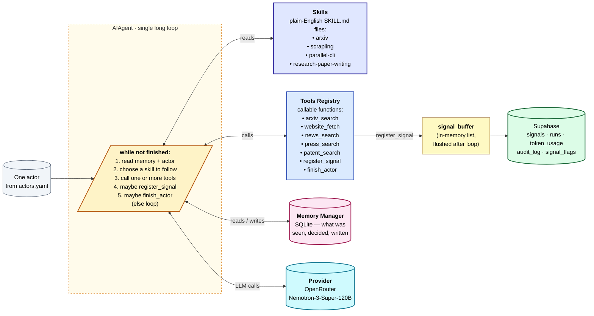
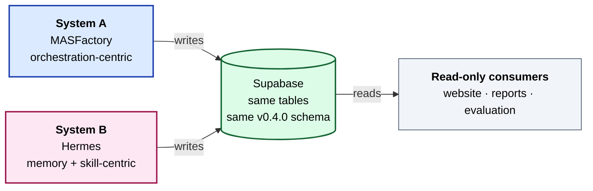

# How the two systems work — visual

Two architectures, one task. Each diagram is rendered as Mermaid so it works on GitHub, in a `docx` paste, and in the live website's Markdown pages.

---

## System A — MASFactory (orchestration-centric)

A **fixed graph** of nodes. Each node is either an **Agent** (calls the LLM) or a **CustomNode** (pure Python — no LLM). The graph runs Planner → Retriever → a per-actor **Loop** → Analyst → Persistence.

```mermaid
flowchart LR
    DOCS[("5 collectors per actor<br/>arXiv · website · Google News<br/>Bing News press · EPO patents")]:::input

    P["<b>Planner</b><br/>Agent<br/><i>picks actors</i>"]:::agent
    R["<b>Retriever</b><br/>CustomNode<br/><i>fetches docs</i>"]:::custom

    subgraph LOOP ["⟳ per-actor Loop · runs once per actor in isolation"]
        direction LR
        PA["<b>PrepareCurrentActor</b><br/>CustomNode<br/><i>one actor's docs</i>"]:::custom
        E["<b>Extractor</b><br/>Agent<br/><i>finds candidate signals</i>"]:::agent
        C["<b>Classifier</b><br/>Agent<br/><i>labels signal_type<br/>+ dimension</i>"]:::agent
        K["<b>Critic</b><br/>Agent<br/><i>drops wrong /<br/>off-topic / boilerplate</i>"]:::agent
        AC["<b>AccumulateActor</b><br/>CustomNode<br/><i>appends to run-wide<br/>accumulator</i>"]:::custom
        PA --> E --> C --> K --> AC
        AC -.->|next actor| PA
    end

    AN["<b>Analyst</b><br/>Agent<br/><i>writes brief.md</i>"]:::agent
    PE["<b>Persistence</b><br/>CustomNode<br/><i>writes Supabase<br/>+ audit folder</i>"]:::custom
    DB[("Supabase<br/>signals · runs · token_usage<br/>audit_log · signal_flags")]:::output

    DOCS --> R
    P --> R --> LOOP --> AN --> PE --> DB

    classDef agent fill:#fef3c7,stroke:#b45309,stroke-width:2px,color:#000
    classDef custom fill:#dbeafe,stroke:#1e40af,stroke-width:2px,color:#000
    classDef input fill:#f1f5f9,stroke:#475569,color:#000
    classDef output fill:#dcfce7,stroke:#166534,stroke-width:2px,color:#000
    style LOOP fill:#fffbeb,stroke:#d97706,stroke-dasharray:4
```

**Legend.** 🟡 yellow = Agent (LLM-bound) · 🔵 blue = CustomNode (pure Python) · 🟢 green = output store.

**The per-actor Loop is the key idea.** Each iteration sees ONE actor's documents only — so the Extractor can't accidentally attribute a signal from PSI's website to ETH. The Critic at the end of each iteration is the quality gate.

**Optional layers** (env-gated, off by default): set `MASF_CRITIC_CONSENSUS_PASSES=3` to swap the single Critic for *three* Critics + a majority vote (Wang et al. 2023 self-consistency); add `MASF_CRITIC_DEBATE_ROUNDS=1` to have the three Critics see each other's verdicts and revise (Du et al. 2023 multi-agent debate).

---

## System B — Hermes pattern (memory- and skill-centric)

A **single AIAgent in one long loop**. No graph. Each iteration, the Agent reads its memory, picks a skill, calls tools, maybe writes a signal, and decides whether to keep going or finish.

**Legend.** 🟡 yellow = the Agent · 🟣 indigo = Skills (procedures the Agent reads like a junior researcher reads a handbook) · 🔵 blue = Tools (functions the Agent can call) · 🩷 pink = Memory · 🔷 teal = LLM Provider · 🟢 green = output store.

**The single loop is the key idea.** No external orchestrator decides what comes next; the Agent does, based on what it remembers and which skill it's currently following. The loop ends when the Agent calls `finish_actor` or hits the iteration cap (`HRM_MAX_ITERATIONS=6` by default).

---

## What they share

Only **the Supabase schema** — `actors`, `signals`, `runs`, `token_usage`, `audit_log`, `signal_flags`. Both write to the same tables with the same v0.4.0 four-signal scheme.

No shared Python code. No shared helper library. This is the **comparative-validity invariant**: it lets the thesis ask *"which architecture works better on the same task?"* without the comparison being polluted by shared utilities.

---

## One-line summary of each

> **System A** is a *fixed assembly line*: every signal goes through the same 7 stations in the same order, but each actor has its own pass through the line.
>
> **System B** is a *junior researcher with a handbook and a desk*: it picks a procedure from the handbook (a skill), uses tools from the desk drawer, jots notes in its notebook (memory), and decides on its own when each actor is done.

Both deliver the same kind of output (classified signals in Supabase). The thesis evaluates *which architecture's outputs are more accurate, cheaper, and more reproducible* on the same Swiss-quantum-ecosystem task.
