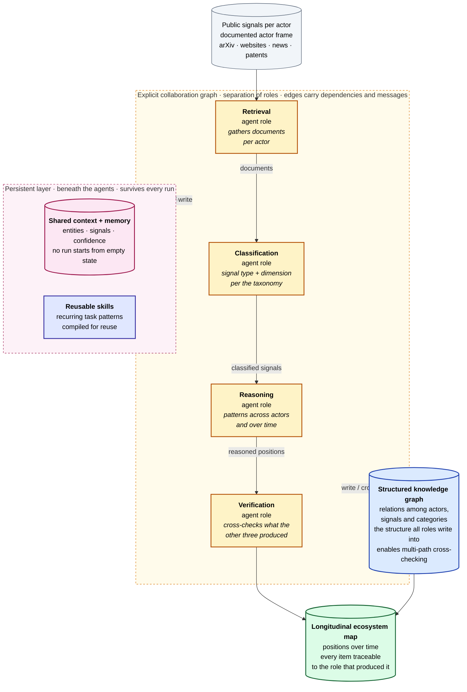

# The ideal reference architecture — visual

The reference architecture synthesised in §2.1.5 of the thesis (SRQ2). This is a
**design synthesis drawn from the literature, not a system that was built** — it
functions as a benchmark against which System A and System B are measured in the
gap analysis (§4.2). Rendered as Mermaid in the same style as the two implemented
systems so it works on GitHub, in a `docx` paste, and on the website's Markdown
pages.

---

## Ideal reference architecture (literature-derived benchmark)

Four roles on an **explicit graph** (nodes host agents/tools, edges carry
dependencies and messages), sitting above a **persistent layer** that survives
every run and writing into a **structured knowledge graph** of relations among
actors, signals and categories.

**Legend.** yellow = agent role on the graph · blue = structured knowledge graph
(the shared structure the roles write into) · pink = persistent memory / shared
context · indigo = reusable skills · slate = input · green = output store.

---

## Why this shape — and where each part comes from

The three requirements below are the ones §2.1.5 derives; the diagram is exactly
their assembly. Nothing here is invented for the picture — each block traces to a
published source.

**1 — Separation of roles along an explicit graph.** Liu et al. (2026) model
collaboration as nodes that host agents or tools and edges that carry
dependencies and messages, which maps onto the four roles this task needs:
retrieval, classification into the signal categories, reasoning over patterns
across actors and over time, and verification of what the other three produced.
Shaw (2001) is the reason to fix these roles *before* any implementation choice:
architecture is the discipline of making structure answer the problem. The
separation also buys **traceability** — every classified item is attributable to
the role that produced it — which is where the reliability requirements Kolbe and
Burnett (1991) set for human coders carry over to machine coding.

**2 — A persistent layer beneath the agents.** Li et al. (2026a) place shared
context and memory beneath the agents in AgentOS; Li et al. (2026b) let OpenSage
compile recurring task patterns into reusable skills; Teknium et al. (2025)
supply a model trained for extended tool use. This layer does real work here: the
research question asks how positions **shift over time**, and that cannot be
answered if every run starts from an empty state and no entity, signal or
confidence judgement survives it.

**3 — A verification stage over a structured knowledge graph.** Public signals
are partial, sometimes promotional, and come from senders under different
institutional constraints, so the architecture needs a verification role and a
**structured representation** of the relations among actors, signals and
categories. Wu et al. (2026, LogicGraph) show current models commit early to one
proof path and lose coverage of the alternatives as depth grows; Wang et al.
(2026) find the same failure on the planning side; Stewart and Buehler (2026)
argue for higher-order knowledge representations for exactly this class of task.
A graph that all four roles write into is what makes cross-checking possible —
and what a flat list of documents does not support.

**A benchmark, not a blueprint.** Calling the architecture *ideal* does not mean
it has been validated. Following Shaw's (2001) pairing of question type with
validation, this answers a **characterisation** question — what such a system
should look like, and how its parts could be assembled — warranted by theoretical
coherence and fit, and tested afterwards against the two implementations (§4.2).

| Component in the diagram | Requirement | Primary sources |
|---|---|---|
| Retrieval / Classification / Reasoning / Verification on an explicit graph | Separation of roles; traceability | Liu et al. (2026); Shaw (2001); Kolbe & Burnett (1991) |
| Shared context + memory; reusable skills | Persistent state across runs for longitudinal mapping | Li et al. (2026a); Li et al. (2026b); Teknium et al. (2025) |
| Structured knowledge graph (actors ↔ signals ↔ categories) | Verification stage + structured representation | Wu et al. (2026); Wang et al. (2026); Stewart & Buehler (2026) |
| Signal type + dimension used by Classification | Signal categories to classify into | taxonomy of §2.1.2 (Ehrenthal et al. 2026) |

---

## One-line summary

> The ideal architecture is **four named roles on one explicit graph, standing on
> a memory that outlives any single run, all writing into a shared graph of who
> emitted what** — so that positions can be read across actors and over time, and
> every reading can be traced back to the role that made it.
