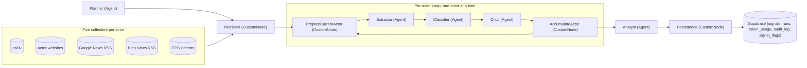
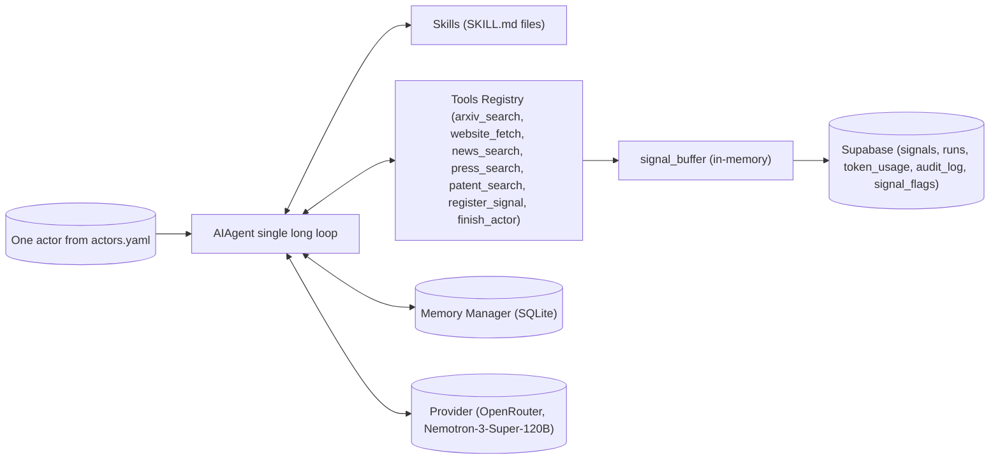
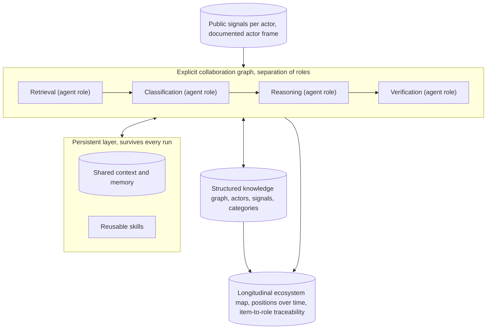

# Architecture figures for the thesis

Three Mermaid diagrams in the same visual style as the top-level [README.md](../README.md) so
they render identically on GitHub. Open this file on GitHub, then screenshot each rendered
diagram at 200 % browser zoom for a docx-ready image.

- Figure A · System A architecture (MASFactory, orchestration-centric)
- Figure B · System B architecture (Hermes, memory- and skill-centric)
- Figure C · Ideal reference architecture (literature synthesis, §2.1.5)

---

## Figure A — System A architecture

Orchestration-centric. A fixed graph of nodes, each either an LLM Agent or a pure Python
CustomNode. Runs Planner, then Retriever, then a per-actor Loop, then Analyst, then Persistence.

**Legend.** Boxes labelled Agent make LLM calls; boxes labelled CustomNode are pure Python.
The Loop runs once per actor in isolation, so no candidate signal can be cross-attributed
between actors. The Critic inside the Loop is the per-actor quality gate.

Source of truth: [systems/masfactory/masfactory_system/graph.py](../systems/masfactory/masfactory_system/graph.py).

---

## Figure B — System B architecture

Memory- and skill-centric. One AIAgent in one long loop. Each iteration the Agent reads its
memory, picks a skill, calls one or more tools, may write a signal, and decides whether to
keep going or finish the actor.

**Legend.** No external orchestrator decides what comes next; the Agent does, based on what
it remembers and which skill it is currently following. The loop ends when the Agent calls
finish_actor or hits the iteration cap (`HRM_MAX_ITERATIONS=6` by default).

Source of truth: [systems/hermes/upstream/agent/conversation_loop.py](../systems/hermes/upstream/agent/conversation_loop.py).

---

## Figure C — Ideal reference architecture

Design synthesis from the literature (thesis §2.1.5). This is a benchmark, not a blueprint,
so no source file implements it. Four roles on an explicit collaboration graph sit above a
persistent layer and all write into a structured knowledge graph.

**Legend and literature backing.**

- Retrieval, Classification, Reasoning, Verification as four distinct roles on an explicit
  graph — Liu et al. (2026); Shaw (2001).
- Persistent layer beneath the agents (shared context and memory, reusable skills) — Li et
  al. (2026a, AgentOS); Li et al. (2026b, OpenSage); Teknium et al. (2025).
- Structured knowledge graph over actors, signals and categories, and a verification stage
  that reads it — Wu et al. (2026, LogicGraph); Wang et al. (2026); Stewart and Buehler
  (2026); Adner (2017).
- Traceability of every classified item to the role that produced it — Kolbe and Burnett
  (1991).

Full component-to-source table: [docs/figures/appendix_c_component_source.md](figures/appendix_c_component_source.md).
